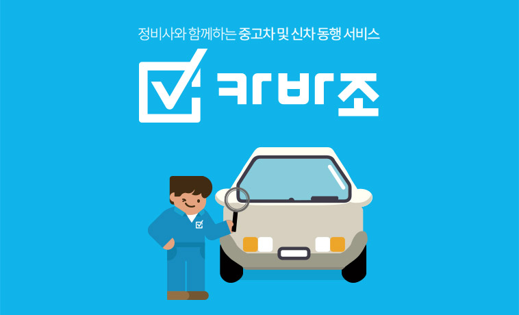
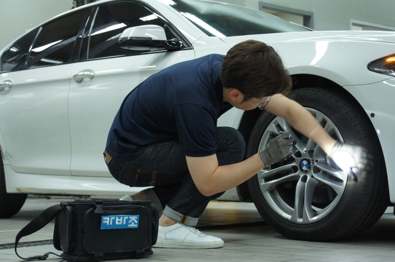
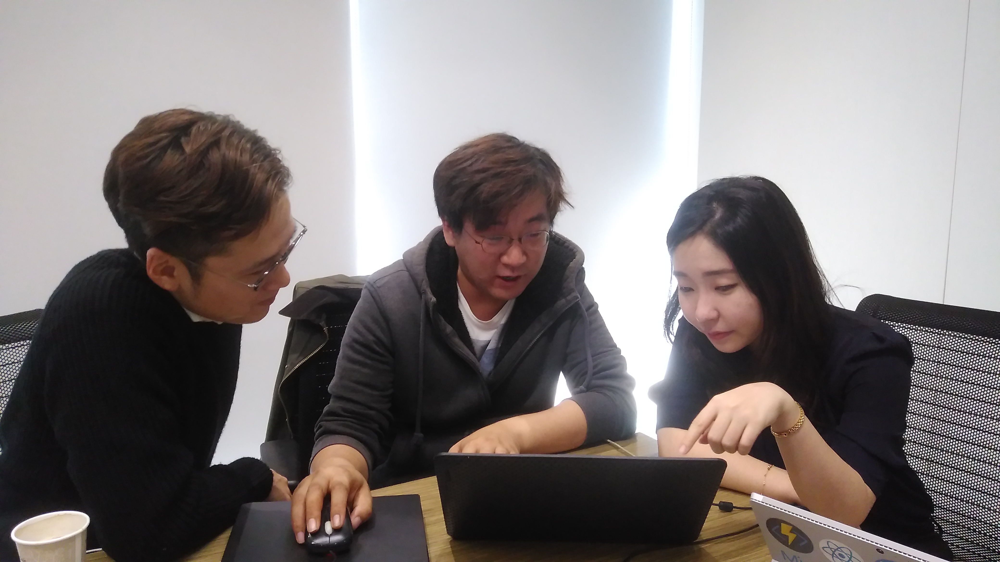
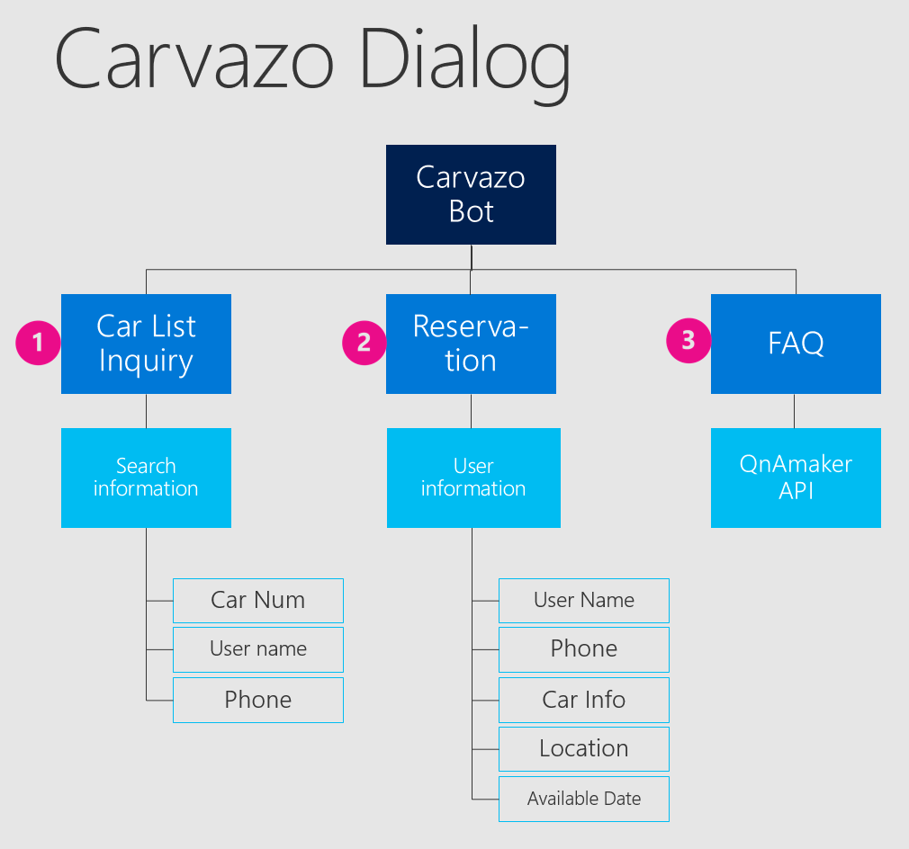
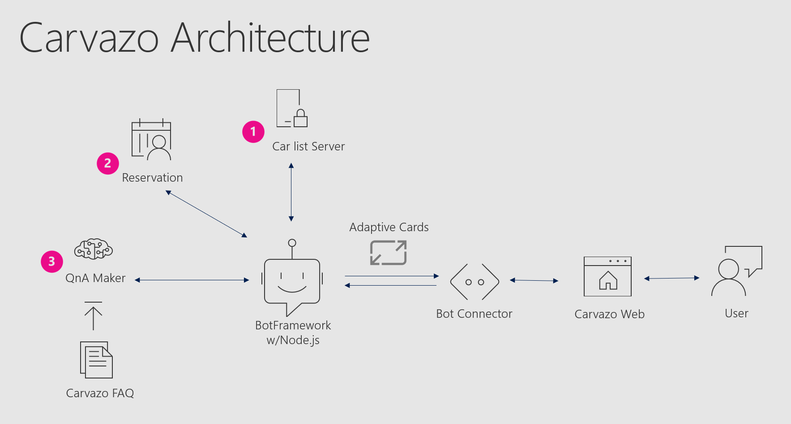
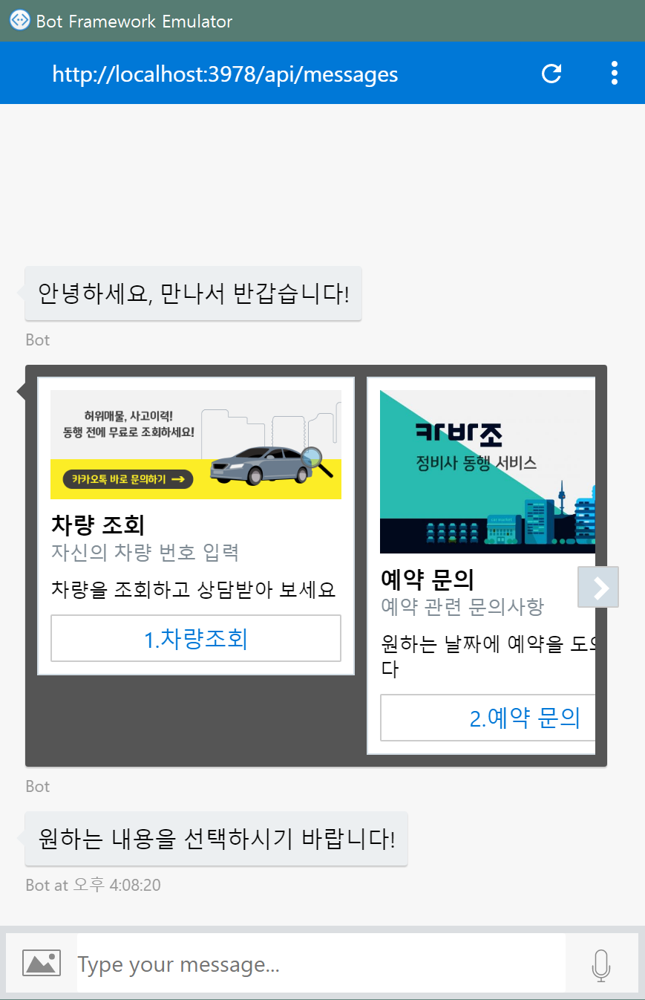

## Key Technologies ##

* [Azure Bot Service](https://azure.microsoft.com/ko-kr/services/bot-service/)
* [QnA Maker](https://qnamaker.ai/)

## Core Project Team ##

* Microsoft
	* Minsoo Bae (Program Manager, Microsoft)
	* [Eunji Kim](https://github.com/angie4u) (Software Engineer, Microsoft)

* Carvazo
	* Tae Ryang Yoo (CEO)
	* Jin Tae Jung (CTO)
 
## Customer Profile ##

[Carvazo](https://www.carvazo.com/), a startup in Korea providing mechanic hiring platform for second hand car buyer

## Problem Statement ##

As business is growing in terms of transactions and visitors, the current business operation proportionaly increases, requiring significant labor hours. Most of user inquiry is simple, therefore the answering task is repetitive and monotonous. Despite of prepared FaQ information, users prefer to make call or to have short chat to human directly. Saving internal resource and capturing the leads from users, the both are crucial objectives for Carvazo's sustainable growth. 

TaeRyang Yoo - the CEO of Carvazo - realized its current customer service has certain limitation and should be developed for further business growth. An automated chat can be solution, but its developing team spends all of time to develop Carvazo's first mobile app for iOS and Androids, which resulted in lack of exploring the newest technologies, such as AI and Bot Framework. 

## Solutions, Steps, and Delivery ##

### Dialog

This services is consists of three dialogs: earlyCarSearch, reservation, askFAQ

* earlyCarSearch : Users can inquire a list of available vehicles.
* reservation : Users can make a car inspection service reservation to a desired place for desired time.
* askFAQ : It responds to users' questions based on FAQ data.

### Architecture

### Application Screenshot

## General lessons ##
* The Bot Builder SDK was well designed, so customer training time was short, and customer learning curve was short. In this case, half-day training alone has taught customers how to use Dialog, and most Dialogs were written by customers.

* Because the Bot Builder SDK supports Nodes, it was convenient to work with existing customer systems, and it was convenient to use several Node packages.

## Conclusion ##
* In small start-ups, there is always a demand for chatbots because of the lack of human resources. It will be easy to find similar scenarios.

* There are many Startups that have no experience on Azure in Korea. Hackfest is a good starting point to experience Azure naturally, so it will increase possibility to adopt Azure when they choosing a cloud infrastructure.

## Resources ##
* [Azure Bot Service - Documentation](https://docs.microsoft.com/ko-kr/bot-framework/bot-service-overview-introduction)
* [QnA Maker - Documentation](https://qnamaker.ai/Documentation)

