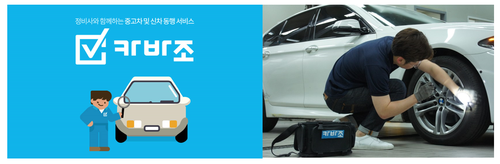

## Key Technologies ##

* [Azure Bot Service](https://azure.microsoft.com/ko-kr/services/bot-service/)
* [QnA Maker](https://qnamaker.ai/)

## Core Project Team ##

* Microsoft
	* Minsoo Bae (Program Manager, Microsoft)
	* [Eunji Kim](https://github.com/angie4u) (Software Engineer, Microsoft)

* Carvazo
	* Tae Ryang Yoo (CEO)
	* Jin Tae Jung (CTO)
 
## Customer Profile ##


[Carvazo](https://www.carvazo.com/), a startup in Korea providing mechanic hiring platform for second hand car buyer

## Problem Statement ##

As business is growing in terms of transactions and visitors, the current business operation proportionaly increases, requiring significant labor hours. Most of user inquiry is simple, therefore the answering task is repetitive and monotonous. Despite of prepared FaQ information, users prefer to make call or to have short chat to human directly. Saving internal resource and capturing the leads from users, the both are crucial objectives for Carvazo's sustainable growth. 

TaeRyang Yoo - the CEO of Carvazo - realized its current customer service has certain limitation and should be developed for further business growth. An automated chat can be solution, but its developing team spends all of time to develop Carvazo's first mobile app for iOS and Androids, which resulted in lack of exploring the newest technologies, such as AI and Bot Framework. 


## Solutions, Steps, and Delivery ##

### Dialog


This services is consists of three dialogs: earlyCarSearch, reservation, askFAQ

* earlyCarSearch : Users can inquire a list of available vehicles.
* reservation : Users can make a car inspection service reservation to a desired place for desired time.
* askFAQ : It responds to users' questions based on FAQ data.

### Architecture


### Technical details of how this was implemented

**[Root Dialog]**
This is the Root Dialog of Carvazo Bot. According to the input of the user, it changes the context of dialog among the three dialogs. 
```
var bot = new builder.UniversalBot(connector, [
  function (session, results, next) {
    if (session.message.text == '홈') {
      var cards = getCardAttachments()
      var reply = new builder.Message(session)
                .attachmentLayout(builder.AttachmentLayout.carousel)
                .attachments(cards)
      session.send(reply)
      builder.Prompts.text(session, '원하는 타입의 옵션을 선택하시기 바랍니다!')
    } else {
      next(session, results)
    }
  },
  function (session, results) {
    session.dialogData = {}
    session.dialogData.select = {}
    session.dialogData.select.type = session.message.text

    if (session.dialogData.select.type == '1') {
      session.userData.early = {}
      session.beginDialog('earlyCarSearch', session.userData.early)
    } else if (session.dialogData.select.type == '2') {
      session.beginDialog('reservation', session.userData.early)
    } else if (session.dialogData.select.type == '3') {
      session.beginDialog('askFAQ', session.userData.early)
    } else {
      session.send('고객센터로 문의 바랍니다. ( 070-7707-3737 )')
    }
  }
])
```

**[Car & Phone number - Check format code]**
Use regular expressions to check that users are entering the appropriate type of input. 
```
function car_num_chk (car_num) {
  var v = car_num

  var pattern1 = /\d{2}[가-힣ㄱ-ㅎㅏ-ㅣ\x20]\d{4}/g // 12저1234
  var pattern2 = /[가-힣ㄱ-ㅎㅏ-ㅣ\x20]{2}\d{2}[가-힣ㄱ-ㅎㅏ-ㅣ\x20]\d{4}/g // 서울12치1233

  if (!pattern1.test(v)) {
    if (!pattern2.test(v)) {
      return false
    } else {
      return true
    }
  } else {
    return true
  }
}

function validate_phone (phone_num) {
  var regExp = /^(01[016789]{1}|02|0[3-9]{1}[0-9]{1})-?[0-9]{3,4}-?[0-9]{4}$/
  var tel = phone_num

  if (!regExp.test(tel)) {
    return false
  } else {
    return true
  }
}
```

**[earlyCarSearch Dialog]**
Asking the necessary information for vehicle inquiry and shows the inquiry result using the input value. The reservation dialog is constructed in a similar manner.
```
bot.dialog('earlyCarSearch', [

  function (session, args) {
    session.dialogData.early = args || {}
    builder.Prompts.text(session, '차량번호를 남겨주시면 확인후 조회를 해드리도록 하겠습니다')
  },
  function (session, results, next) {
    if (!car_num_chk(results.response)) {
      session.send('차량번호가 올바르지 않아요.')
      next({ resumed: builder.ResumeReason.back })
    } else {
      session.dialogData.early.carNumber = results.response
      builder.Prompts.text(session, '고객님의 성함을 알려주세요')
    }
  },
  function (session, results) {
    console.log(session.dialogData.early)
    session.dialogData.early.userName = results.response
    builder.Prompts.text(session, '연락받으실 휴대폰번호를 알려주세요. (예시) 010-1234-5678')
  },
  function (session, results, next) {
    if (!validate_phone(results.response)) {
      session.send('휴대폰 번호는 010-1234-5678 혹은 01012345678 형태여야 합니다.')
      next({ resumed: builder.ResumeReason.back })
    } else {
      session.dialogData.early.phoneNumber = results.response
      session.send('감사합니다. 차량을 조회하고 연락드리도록 하겠습니다.')
      session.dialogData.early.type = 'ealry'
      sendEalryAccess(session.dialogData.early)

      session.send('처음으로 돌아가고 싶으신 경우 "홈"을 입력해주세요')
      session.endDialogWithResult({response: session.dialogData.early})
    }
  }
])
```

**[Connect with QnA maker API]**
This function calls the qna maker service configured in advance and returns the most probable answer.
```
var fQnAMaker = function (session, iQuestion) {
    // definitions
  var lQnaMakerServiceEndpoint = 'https://westus.api.cognitive.microsoft.com/qnamaker/v2.0/knowledgebases/'
  var lQnaApi = 'generateanswer'
  var lKnowledgeBaseId = 'KEY'
  var lSubscriptionKey = 'KEY'
  var lHtmlentities = new entities.AllHtmlEntities()
  var lKbUri = lQnaMakerServiceEndpoint + lKnowledgeBaseId + '/' + lQnaApi
  request({
    url: lKbUri,
    method: 'POST',
    headers: {
      'Content-Type': 'application/json',
      'Ocp-Apim-Subscription-Key': lSubscriptionKey
    },
    body: '{"question":"' + iQuestion + '"}'
  },
    function (error, response, body) {
      var lResult
      var stopQNA
      if (!error) {
        lResult = JSON.parse(body)
        lResult.answer = lHtmlentities.decode(lResult.answer)
      } else {
        lResult.answer = 'Unfortunately an error occurred. Try again.(fQnAMaker)'
        lResult.score = 0
      }

      session.send(lResult.answer)
      session.send('처음으로 돌아가고 싶으신 경우 "홈"을 입력해주세요')
    })
}
```


### Application Screenshot


## General lessons ##
* The Bot Builder SDK was well designed, so customer training time was short, and customer learning curve was short. In this case, half-day training alone has taught customers how to use Dialog, and most Dialogs were written by customers.

* Because the Bot Builder SDK supports Nodes, it was convenient to work with existing customer systems, and it was convenient to use several Node packages.

## Conclusion ##
* In small start-ups, there is always a demand for chatbots because of the lack of human resources. It will be easy to find similar scenarios.

* There are many Startups that have no experience on Azure in Korea. Hackfest is a good starting point to experience Azure naturally, so it will increase possibility to adopt Azure when they choosing a cloud infrastructure.

## Resources ##
* [Azure Bot Service - Documentation](https://docs.microsoft.com/ko-kr/bot-framework/bot-service-overview-introduction)
* [QnA Maker - Documentation](https://qnamaker.ai/Documentation)

